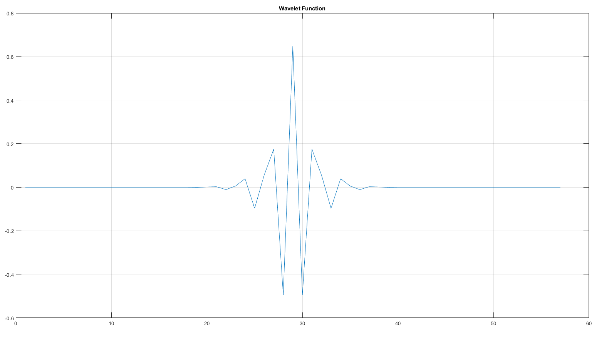
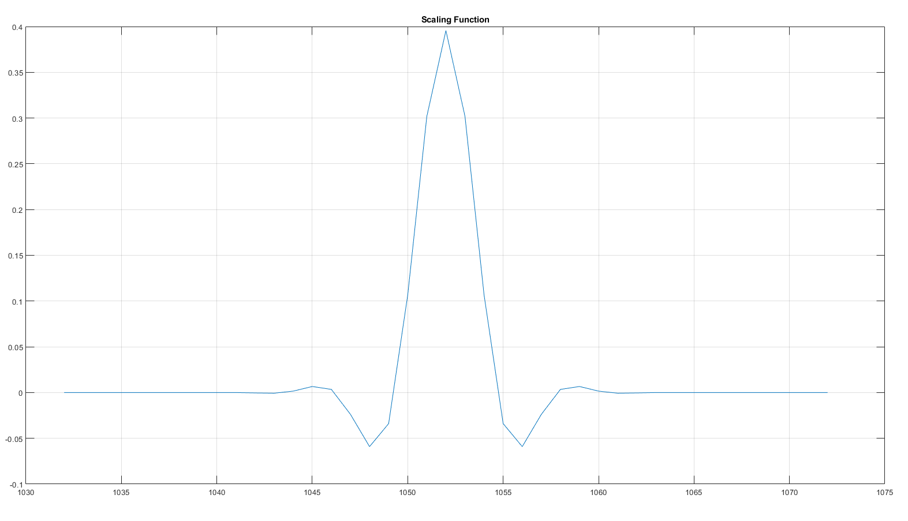
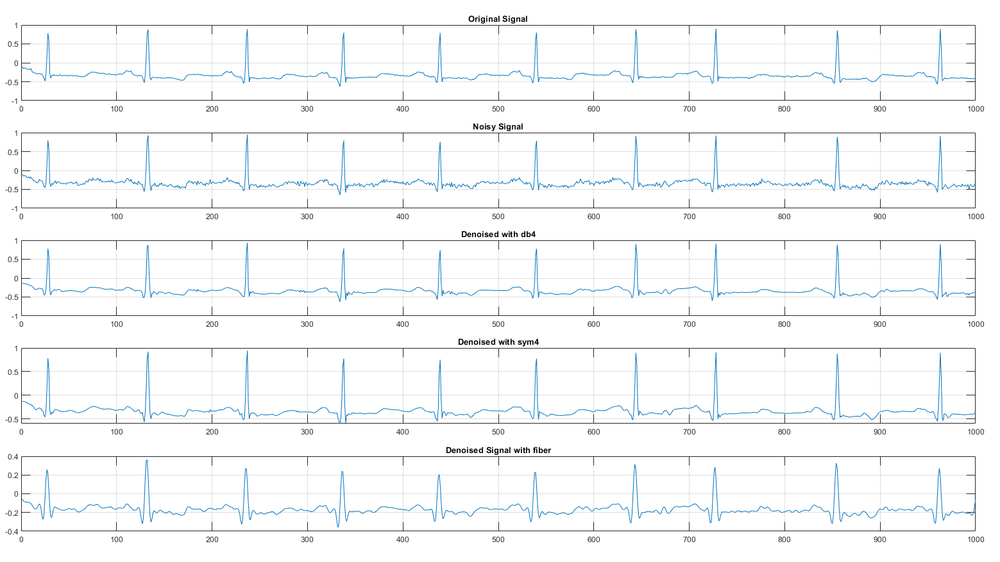

<h1 align="center">
  <i><font color="#4A7EBB">Wavelet-based ECG Denoising</font></i>
</h1>

<p align="center">
  <b>MATLAB Implementation of</b><br>
  <b><a href="https://www.researchgate.net/publication/330691725_A_new_modified_wavelet-based_ECG_denoising">A New Modified Wavelet-Based ECG Denoising</a> (Wang et al., 2019)</b><br>
</p>

<!-- <p align="center">
  <b>This repository provides a reimplementation of the paper </b><br><b><a href="https://www.researchgate.net/publication/330691725_A_new_modified_wavelet-based_ECG_denoising"> A New Modified Wavelet-Based ECG Denoising </a> (Wang et al., 2019)</b><br>. This study proposes a modified wavelet-based ECG denoising method that addresses the challenge of frequency overlap between ECG and EMG signals. By optimizing filter coefficients to approximate an ideal amplitude-frequency response, a new wavelet is constructed and applied to clinical ECG data. Results demonstrate that the method effectively removes high-frequency noise, preserves weak features like P and T waves, and improves SNR and MSE compared to traditional wavelets like db4 and sym4. The approach offers valuable guidance for mobile ECG analysis and weak signal denoising.

</p> -->

## 📌 Overview

This repository is a MATLAB reimplementation of the seminal paper [*A New Modified Wavelet-Based ECG Denoising*](https://www.researchgate.net/publication/330691725_A_new_modified_wavelet-based_ECG_denoising) by Wang et al. This project implements a modified wavelet-based ECG denoising method designed to improve signal-to-noise ratio (SNR) and preserve key morphological features. Addressing the challenge of frequency overlap between ECG and EMG signals, the method constructs a new wavelet by optimizing filter coefficients to approximate an ideal amplitude-frequency response. Applied to clinical ECG data, it effectively removes high-frequency noise while enhancing weak features such as P and T waves. Compared to traditional wavelets like db4 and sym4, it achieves superior SNR and lower mean squared error (MSE). This approach is well-suited for real-time or preprocessing applications in biomedical systems, particularly mobile ECG analysis and other weak signal denoising tasks.


## 🧠 Methodology

1. **Filter Optimization**  
Design filter coefficients by approximating the amplitude-frequency response of an ideal low-pass filter.

2. **Wavelet Construction**  
   Construct a custom wavelet using the optimized filter to satisfy orthogonality and compact support.

<div align="center">
  
  
</div>

<p align="center">
  <em>Figure 1: (Left) Wavelet Function, (Right) Scaling Function</em>
</p>

3. **Signal Decomposition**  
   Apply Discrete Wavelet Transform (DWT) to decompose the noisy ECG signal into multiple levels.

4. **Noise Suppression**  
   Perform soft thresholding on the detail coefficients to eliminate high-frequency noise while preserving signal morphology.

5. **Signal Reconstruction**  
   Use inverse DWT to reconstruct the denoised ECG signal from the thresholded coefficients.

6. **Performance Evaluation**  
   Assess the method using metrics such as SNR, MSE, and correlation, comparing results with standard wavelets like `db4` and `sym4`.

## 📂 Folder Structure

``` bash
├── Denoising.m             
├── Optimization.m  
├── WaveletGenerator.m                          
├── ECGData.mat
```

## 📊 Results

We implemented the denoising pipeline based on the methodology proposed in the original study, initially attempting to optimize custom wavelet filters using a symmetric error function. However, due to the non-convex nature of the optimization problem, we adopted the filter coefficients provided in the paper to construct our custom scaling and wavelet functions (see Figures 1).

To evaluate the method, we used a publicly available ECG dataset (ECGData, 2016) and added White Gaussian Noise (WGN) with an amplitude of 0.03V to simulate a noisy acquisition environment. The denoising was performed using a single-level wavelet decomposition.

 Visual results (Figure 2) show that our method more effectively suppresses high-frequency noise while preserving key ECG features such as the P and T waves.

 <div align="center">
  

</div>

## 🙏 Acknowledgments

This repository is a course project reimplementation of the paper by Wang et al. (2019) as part of the Digital Signal Processing course at Concordia University.

We thank the original authors for their pioneering work and the course instructors for his guidance.

Developed by:
- **Sepehr Ghamari**  
- **Arman Bakhtiari**  

Special thanks to Dr. Khaled Humadi for technical insights and support.


## 📬 Contact

If you have any questions or feedback, feel free to contact us at:

📧 se_gham@encs.concordia.ca 

📧 sepehrghamri@gmail.com

